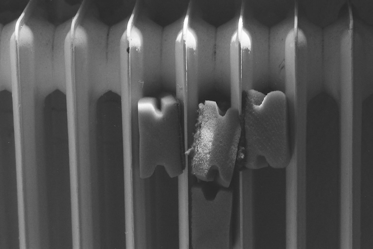

# Post 0
This is post 0. Testing markdown.

## This is a h2 headline
This is a paragraph.

### This is a h3 headline
This is a [link to the first blogpost](/posts/post-1).

### Another h3 headline
- an
- unordered
- list

### An ordered list
1. an
2. ordered
3. list

## An image

## That's it
That's it.
